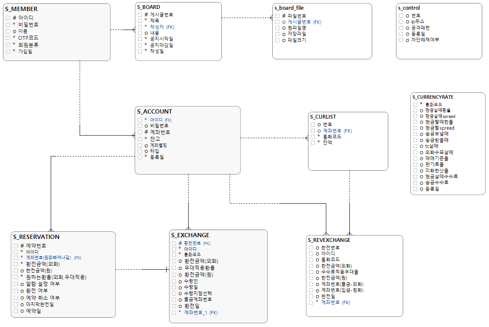
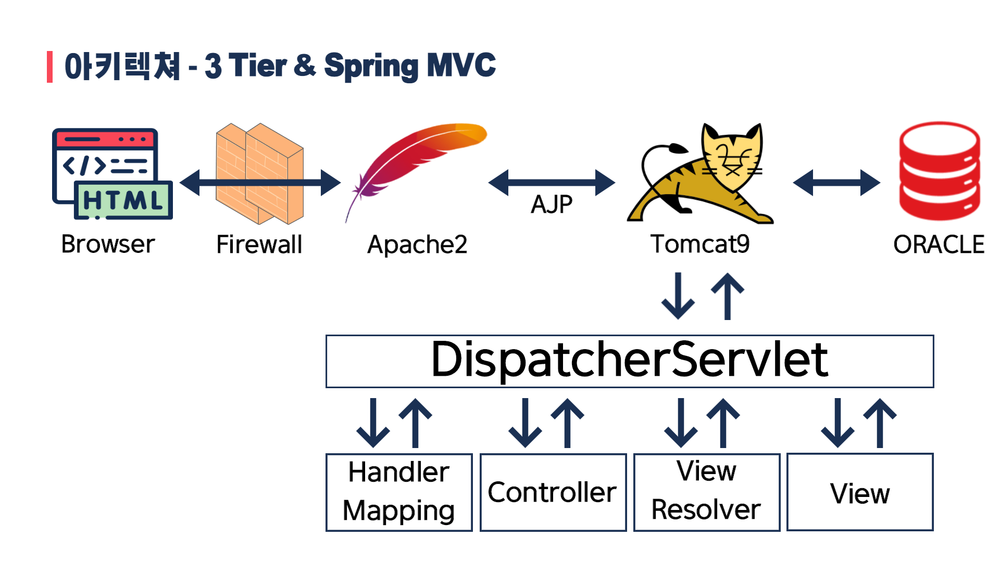
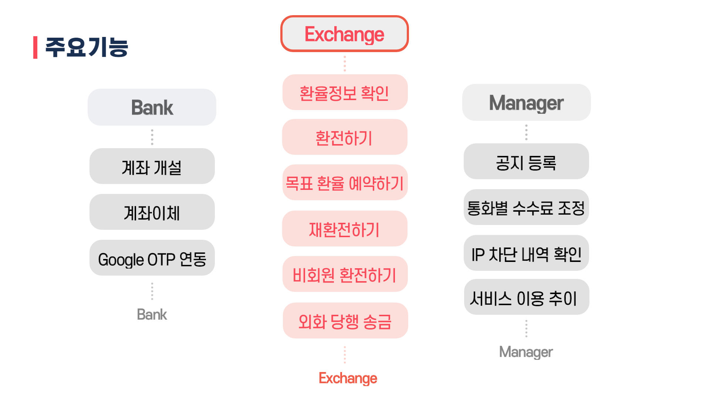
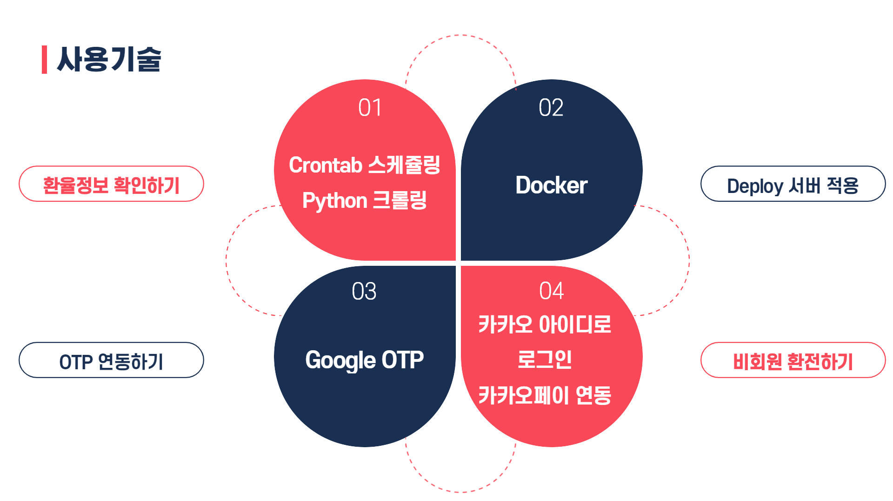
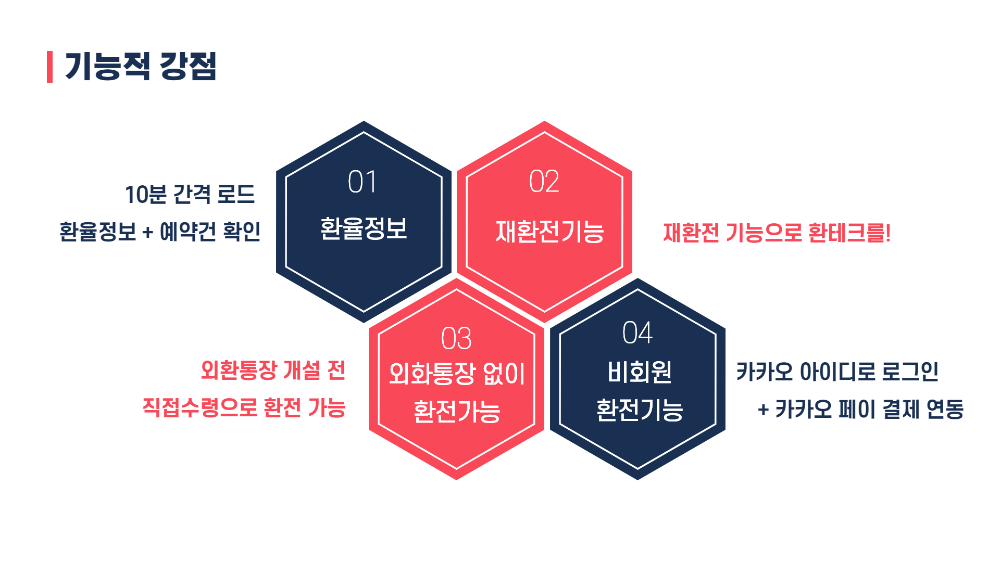
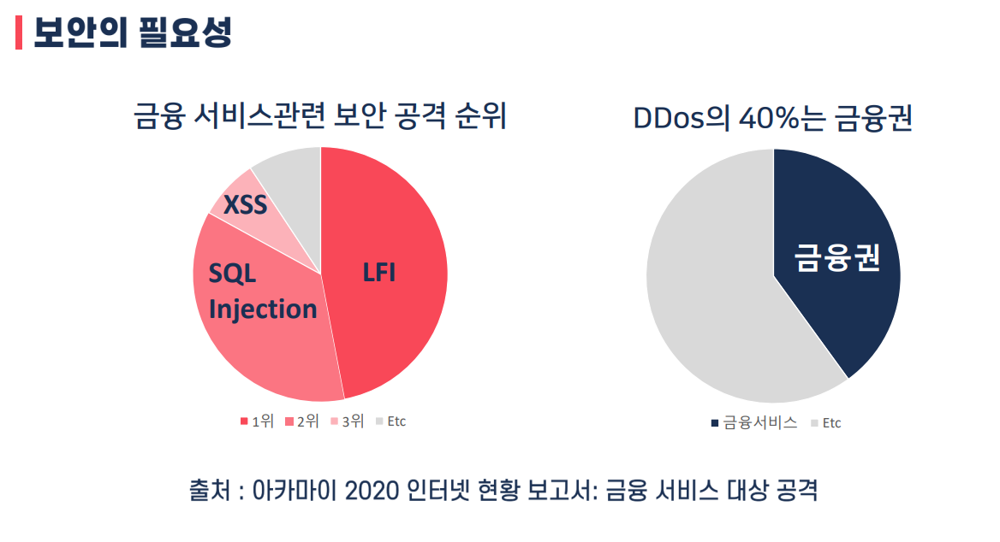
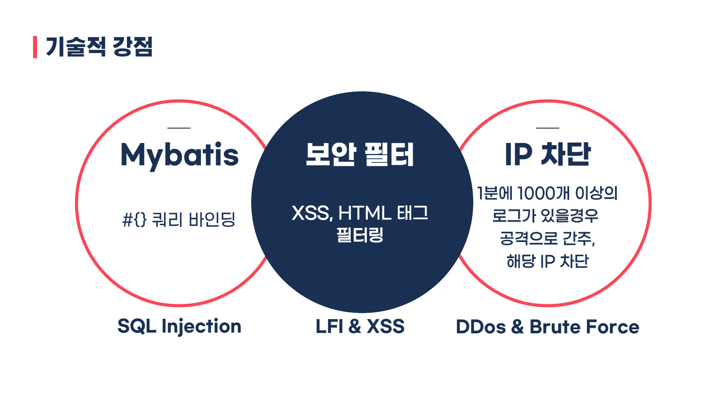
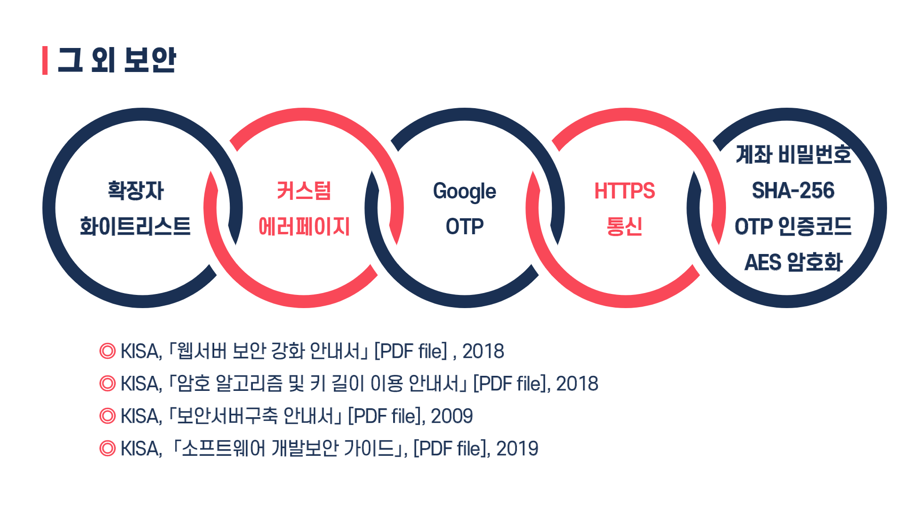

# 동기들과 공유한 홈페이지 입니다.
주소 : https://www.notion.so/luciddd/ea22e9bd84f944eeab64712a36f64a3b   
각자의 프로젝트를 진행하면서 동기들에게 공유하고 싶은 내용들을 공유한 사이트 입니다. 
(Ex. 본인이 사용한 API 쉽게 적용하는 법, 환율정보 크롤링 하는법, Dummy Data 생성하는 법 with 가중치)  
-> Notion으로 만든 홈페이지라 **크롬** 혹은 **파이어폭스** 등에서 접근 가능합니다. (**익스플로러에서 접근이 불가능합니다.**)      

# 안전한 환전지갑

# 1. 프로젝트 제안서
    
   [발표자료확인하기](/제안서_2060340021_최윤선-최종.pdf)   

# 2. 프로젝트 진행사항
[프로젝트 진행 과정 정리](https://www.notion.so/luciddd/Project-729ed3357834484483f7348842362f07)  
-> Notion으로 만든 홈페이지라 **크롬** 혹은 **파이어폭스** 등에서 접근 가능합니다. (**익스플로러에서 접근이 불가능합니다.**)      

# 3. 프로젝트 소개
### 안전한 환전지갑의 특징
하나은행과 타깃 경쟁사인 신한은행의 서비스 중 장점이라 여겨지는 부분 벤치마킹한 후 **보안성을 높임.**   

### ERD
    

### 아키텍쳐
    

### 주요기능
  

### 사용기술
  

### 기능적 강점
  

### 보안관련
  
  
   

# 4. 프로젝트 결과
홈페이지 (주소 : https://sbank.ml/SBANK/  : 무료 서버 반납으로 현재 사용 불가능합니다. )  
포트폴리오 문서 [자료확인하기](/2060340021_포트폴리오-제출용.pdf)   

## 발표 ppt 
    
   [발표자료확인하기](/2060340021_최윤선_PPT_GIT.pdf)  

## 시연 동영상 

   이미지 클릭시 이동하여 영상 확인      
.   
